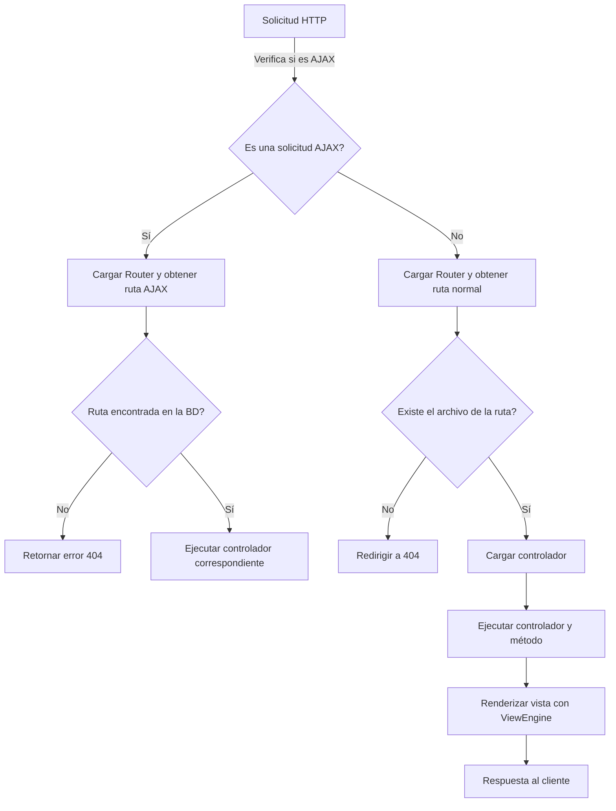
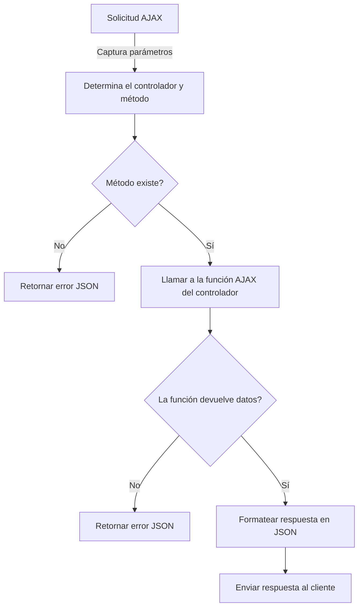
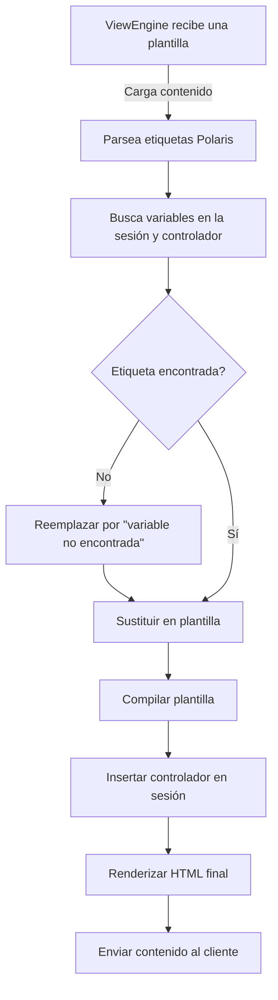
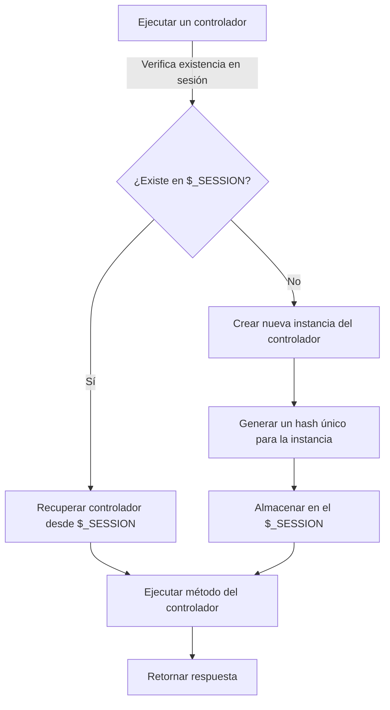

# Proyecto Integrador - Campamento Infantil

## Descripción

Este proyecto es una aplicación web desarrollada como parte del Proyecto Integrador del ciclo formativo de Desarrollo de Aplicaciones Web. Su propósito es facilitar la gestión de un campamento infantil mediante una plataforma digital que permite la inscripción de participantes, la administración de actividades y la supervisión de monitores.

La aplicación ha sido desarrollada utilizando una arquitectura **Modelo-Vista-Controlador (MVC)** y tecnologías modernas para garantizar seguridad, escalabilidad y eficiencia en la gestión de datos.

## Tecnologías utilizadas

### Backend
- **PHP**: Lenguaje principal del lado del servidor.
- **Polaris**: Framework utilizado para la gestión de rutas y controladores.
- **MySQL**: Base de datos relacional para almacenamiento y gestión de la información.
- **Composer**: Gestor de dependencias de PHP.
- **Monolog**: Sistema de logging para el registro de eventos en el servidor.
- **PHPUnit**: Framework para la realización de pruebas unitarias.

### Frontend
- **HTML5**: Estructura de la aplicación web.
- **CSS3 / TailwindCSS**: Estilización de la interfaz y diseño responsive.
- **JavaScript / jQuery**: Interactividad y gestión dinámica de la UI.
- **AJAX**: Comunicación asíncrona entre frontend y backend.

### Despliegue y configuración
- **Apache**: Servidor web configurado con `.htaccess`.
- **Docker**: Contenedores para gestionar entornos de desarrollo y producción.
- **Git/GitHub**: Control de versiones y almacenamiento del código fuente.
- **Debian 12**: Sistema operativo utilizado en entornos de desarrollo y producción.

## Estructura del Proyecto

```
📂 src/
 ├── kernel.php         # Centro de control de solicitudes de Polaris
 ├── polaris.php        # Inicialización de Polaris
 ├── .htaccess          # Configuración de Apache para rutas
 ├── composer.json      # Dependencias de PHP
 ├── config.ini         # Configuración de la base de datos
 ├── 📂 apache/         # Configuraciones específicas de Apache
 ├── 📂 app/            # Módulos de Polaris
 │   ├── Router.php     # Enrutador
 │   ├── Model.php      # Clase de base de datos
 │   ├── ViewEngine.php # Compilador de templates
 │   ├── sdk.php        # Funciones generales (depuración, redirección...)
 │   ├── app.php        # Funciones globales de los templates
 │   ├── labels.json    # Labels de la aplicación
 │   └── Logger.php     # Socket global de Monolog
 │
 ├── 📂 assets/         # Archivos estáticos (imágenes, iconos, fuentes)
 ├── 📂 css/            # Estilos y personalización visual
 │ 
 ├── 📂 init/           # Bases de datos
 │   ├── 📂 polaris/    # Configuración de Polaris
 │   │   ├── init.php   # Inicialización del framework
 │   │   └── init.sql   # Scripts SQL de inicialización
 │   └── 📂 project/    # Configuración del proyecto
 │       ├── init.php   # Variables y constantes globales
 │       └── init.sql   # Base de datos inicial
 │ 
 ├── 📂 js/             # Scripts de interacción cliente-servidor
 ├── 📂 models/         # Modelos de la base de datos
 ├── 📂 pages/          # Vistas y controladores para cada sección
 │   ├── Activities/
 │   │   ├── Activities.html
 │   │   ├── Activities.js
 │   │   └── Activities.php
 │   ├── Login/
 │   │   ├── Login.html
 │   │   ├── Login.js
 │   │   └── Login.php
 │   └── Tutor/
 │       └── Account/
 │           ├── Account.html
 │           ├── Account.js
 │           └── Account.php
 │ 
 ├── 📂 tests/          # PHPUnit
 ├── 📂 vendor/         # Dependencias de Composer
 ├── .gitignore         # Archivos y carpetas ignorados en Git
 └── README.md          # Documentación del proyecto
```

## Instalación y Configuración

### 1. Clonar el repositorio
```bash
git clone git@github.com:DCV05/Proyecto-Integrador.git
cd Proyecto-Integrador
composer install
```

### 2. Configuración del Servidor Apache
Es necesario modificar la configuración de Apache para permitir el uso de `.htaccess`. Edita el archivo de configuración de Apache (`apache2.conf` en Debian/Ubuntu) y cambia:

```apache
<Directory /var/www/html/proyecto_integrador>
    Options Indexes FollowSymLinks
    AllowOverride All
    Require all granted
</Directory>
```

Luego, reinicia Apache:
```bash
sudo systemctl restart apache2
```

### 3. Configuración de la Base de Datos
El archivo `config.ini` debe configurarse correctamente para que la aplicación pueda conectarse a la base de datos MySQL:

```ini
[mysql]
db_server   = localhost
db_user     = root
db_password = root
db_sys      = polaris
db_project  = proyecto_integrador
```


### 4. Configuración de AJAX
El archivo `crypt_config.ini` debe configurarse con una llave privada de encriptación para poder realizar consultas AJAX dentro del sistema:

```ini
[pl_encrypt]
private_key = ad05f78187c942f9dd521605fa81f1ba
```

## Flujos del sistema Polaris
Dentro del entorno de Polaris, existen diferentes flujos y procesos que pueden facilitar el desarrollo, seguridad y escalabilidad de un proyecto. A continuación, se presentan unos diagramas con los diferentes flujos de Polaris:

### **Flujo de Enrutamiento y Carga del Controlador**




### **Flujo de Procesamiento de AJAX**




### **Flujo de Renderizado con ViewEngine**



### **Flujo de Serialización de Controladores en la Sesión**



## Contribuciones y Contacto
Para reportar errores o contribuir con mejoras, puedes abrir un issue en el repositorio de GitHub o contactar a **daniel.correa@kodalogic.com**.
