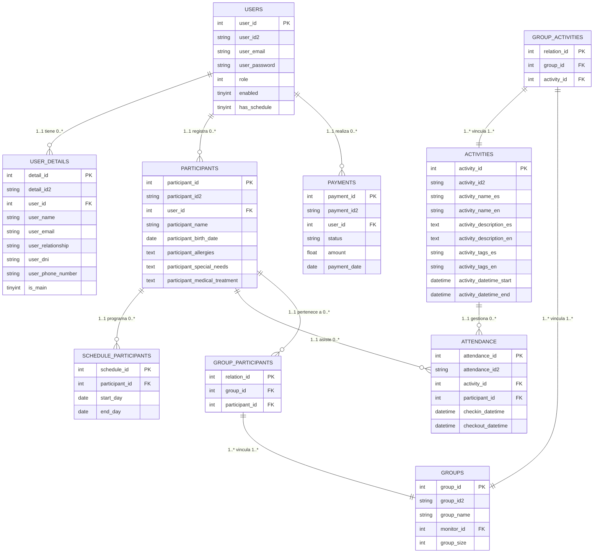

```mermaid
erDiagram

    USERS {
        int user_id PK
        string user_id2
        string user_email
        string user_password
        int role
        tinyint enabled
        tinyint has_schedule
    }

    USER_DETAILS {
        int detail_id PK
        string detail_id2
        int user_id FK
        string user_name
        string user_email
        string user_relationship
        string user_dni
        string user_phone_number
        tinyint is_main
    }

    PARTICIPANTS {
        int participant_id PK
        string participant_id2
        int user_id FK
        string participant_name
        date participant_birth_date
        text participant_allergies
        text participant_special_needs
        text participant_medical_treatment
    }

    GROUPS {
        int group_id PK
        string group_id2
        string group_name
        int monitor_id FK
        int group_size
    }

    GROUP_PARTICIPANTS {
        int relation_id PK
        int group_id FK
        int participant_id FK
    }

    ACTIVITIES {
        int activity_id PK
        string activity_id2
        string activity_name_es
        string activity_name_en
        text activity_description_es
        text activity_description_en
        string activity_tags_es
        string activity_tags_en
        datetime activity_datetime_start
        datetime activity_datetime_end
    }

    GROUP_ACTIVITIES {
        int relation_id PK
        int group_id FK
        int activity_id FK
    }

    ATTENDANCE {
        int attendance_id PK
        string attendance_id2
        int activity_id FK
        int participant_id FK
        datetime checkin_datetime
        datetime checkout_datetime
    }

    PAYMENTS {
        int payment_id PK
        string payment_id2
        int user_id FK
        string status
        float amount
        date payment_date
    }

    SCHEDULE_PARTICIPANTS {
        int schedule_id PK
        int participant_id FK
        date start_day
        date end_day
    }

    USERS ||--o{ USER_DETAILS : "1..1 tiene 0..*" 
    USERS ||--o{ PARTICIPANTS : "1..1 registra 0..*" 
    USERS ||--o{ PAYMENTS : "1..1 realiza 0..*" 

    PARTICIPANTS ||--o{ SCHEDULE_PARTICIPANTS : "1..1 programa 0..*" 
    PARTICIPANTS ||--o{ ATTENDANCE : "1..1 asiste 0..*" 
    PARTICIPANTS ||--o{ GROUP_PARTICIPANTS : "1..1 pertenece a 0..*" 

    ACTIVITIES ||--o{ ATTENDANCE : "1..1 gestiona 0..*" 
    GROUP_PARTICIPANTS ||--|| GROUPS : "1..* vincula 1..*" 

    GROUP_ACTIVITIES ||--|| ACTIVITIES : "1..* vincula 1..*" 
    GROUP_ACTIVITIES ||--|| GROUPS : "1..* vincula 1..*" 
```